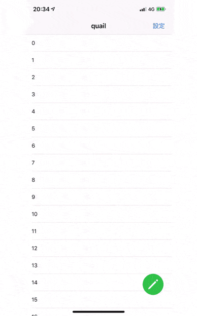

# [iOS13]アプリ内のLight <->Dark切り替え

UserInterfaceStyleをアプリ内で変更する方法をメモしておきます。


## デモ

こんな感じのやつ



## コード

```swift
import UIKit

final class ViewController: UIViewController {

    @IBOutlet private weak var userInterfaceStyleSwitch: UISwitch!
    @IBOutlet private weak var userInterfaceStatusLabel: UILabel!

    override func viewDidLoad() {
        super.viewDidLoad()

        userInterfaceStyleSwitch.isOn = UITraitCollection.current.userInterfaceStyle == .dark
        userInterfaceStatusLabel.text = UITraitCollection.current.userInterfaceStyle == .dark ? "Dark" : "Light"
    }

    @IBAction private func switched(_ sender: UISwitch) {
        navigationController?.overrideUserInterfaceStyle = sender.isOn ? .dark : .light
        userInterfaceStatusLabel.text = sender.isOn ? "Dark" : "Light"
    }
}
```


## 解説

`overrideUserInterfaceStyle`はViewController単位で変更することが出来ます。

親のViewControllerが変更されたら子のViewControllerにも変更が適応されるので、今回は一番の親であるnavigationControllerのoverrideUserInterfaceStyleプロパティに変更を与えています。